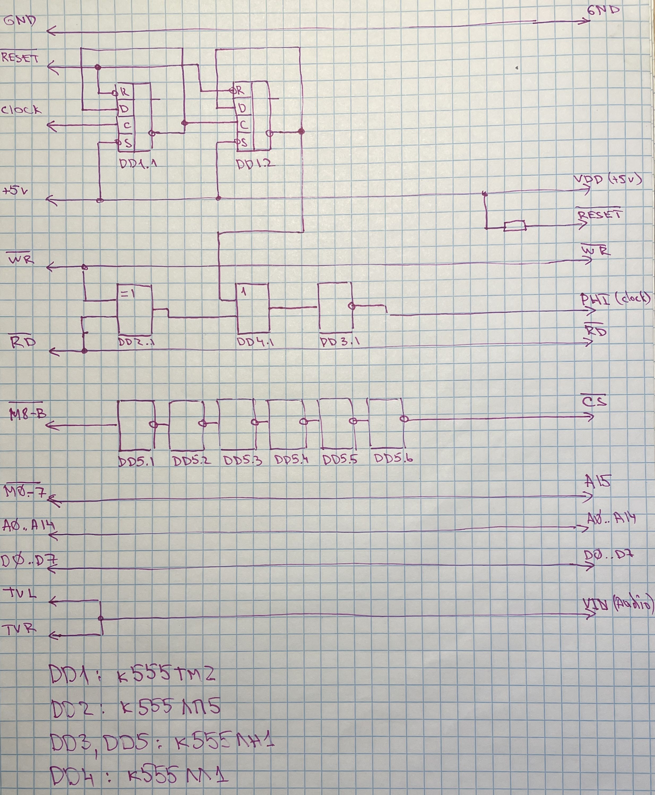

# The Game Boy carts to Game Gear adapter

This adapter was designed to be used with the Game Boy reflashable Camera, running the build of "Photo!" ROM the Game Gear, the custom Game Boy Camera ROM, which may be downloaded here: https://github.com/untoxa/gb-photo/releases/latest/

Beside "Photo!", you can run your own homebrew ROMs for the Game Gear using the reflashable carts for the Game Boy, but this adapter will not allow to play the Game Boy games on the Game Gear without rewriting them.

TODO: add details

## Schematic

## Photo! running on the Game Gear using the GameBoy-to-GameGear adapter:

